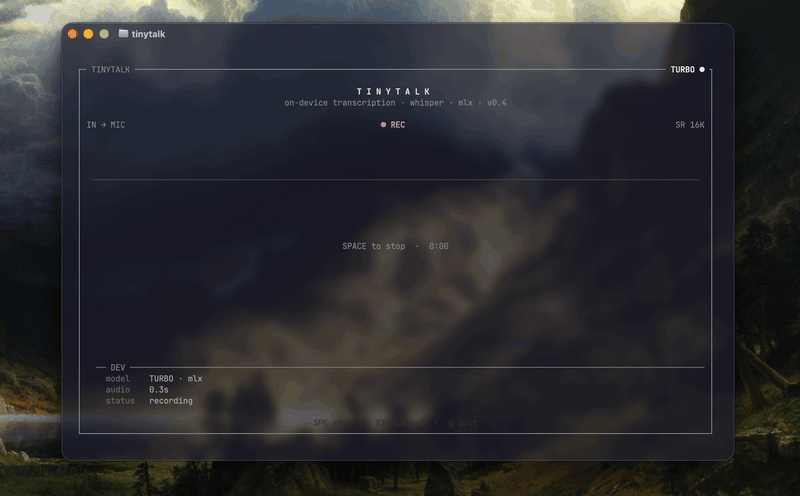

# tinytalk

Push-to-talk terminal transcription using local on-device Whisper. macOS uses MLX, Windows and Linux use faster-whisper with automatic GPU acceleration (CUDA) and CPU fallback. No data leaves your device.

Press space to start recording, press again to stop and transcribe.

Full documentation is in `MANUAL.md`.

## How does it look?

<p align="center">

</p>

## Quick start

Download the latest release from the [releases page](https://github.com/DamienBlackwood/tinytalk/releases). (macOS for now.)

Install instructions for each platform are in [`MANUAL.md`](MANUAL.md).

Models download automatically the first time you use them, no account needed.

```bash
tinytalk                    # record and transcribe
tinytalk --input clip.mp3   # transcribe a file instead
tinytalk log                # read back what you've said
tinytalk --help             # everything else
```

I plan to *formally* add video format support, by explicitly extracting audio.

I plan to upload this to PyPI once it is more polished and ready.

## Rationale

I wanted something quick and keyboard driven to make audio transcription without going through any cloud providers. On Apple Silicon, the Whisper model runs fast enough to perform transcription in "realtime" (after the initial load & compile) without uploading audio anywhere. It uses raw curses the same way my other project, [kmatrix](https://github.com/DamienBlackwood/kmatrix), does.

## Under the hood

It took a few weeks of on-and-off work for the first version, with some genuine problems involved.

One annoying issue was rendering the waveform graphically; it recomputed the entire buffer each time rather than keeping track, leading to graphical glitches with bars moving regardless of audio input. Solved by maintaining a scrolling buffer and adding a single point per update.

Another nasty bug involved Ghostty; for reasons unknown to me, the box-drawing characters (like `┌─┐│└┘`) were drawn incorrectly despite font support.

In my case, I use Ghostty, so that meant the `xterm-ghostty` terminfo entry marked them as double-width, which is incorrect. curses uses terminfo to compute new cursor positions, so each `─` character advanced the cursor two columns rather than one. This screwed up all further character drawing.

The one that took longest to find was quieter than either. Every drawing call sat inside a bare `try/except`, so anything that overran the edge of the terminal simply vanished instead of complaining. A 60-column window had been drawing its right-hand rail one column off the screen for months. Everything now goes through a single clip pass, and there's a test that walks every state at every size looking for exactly that.

I'll be using the commits and messages in them as notes *for me*, to keep myself accountable. 😎

## Your transcripts

Every transcription is appended to `~/.tinytalk/transcripts.jsonl`, with the text encrypted (AES-256-GCM) and the metadata left readable. `tinytalk log` reads them back.

The key lives beside the log, so this stops someone idly scrolling through the file, but... it will not stop anyone who has your home folder and I'd rather say that quite clearly. BUT, PIN-derived keys are the next thing on my list!!

Set `TINYTALK_HOME` if you'd rather keep all of that somewhere else.

## Tests

```bash
python -m unittest discover tests
```

All code written and thought out by me, with only **minor** assistance from AI (in formatting or cleanliness). But mostly drawn from existing research/examples and implemented independently.

## License

MIT
